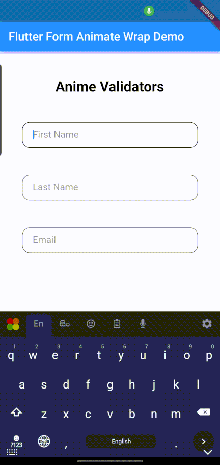

Animated wrappers which can used to wrap around TextFormField  to get some nice interactions

## Installation

In the `pubspec.yaml` of your flutter project, add the following dependency:
 ``` yaml dependencies:
 form_animate_wrap: ^0.0.1
```
Import it to each file you use it in:
 ``` dart
 import 'package:form_animate_wrap/form_animate_wrap.dart';
 ```

## Usage

### Anime Validators

{:width="400px"}

This wrapper is used to wrap around TextFormField if you need a animation to the TextFormField on event such as validation error.

``` dart
TextEditingController firstNameController = TextEditingController();

AnimeValidator(
   enableAnimation: true,
   child: CustomTextFormField( 
   controller: firstNameController,
   hintTextVal: "First Name",
)),
```