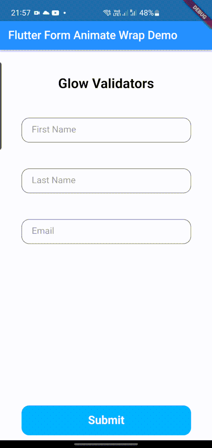

Animated wrappers which can used to wrap around TextFormField  to get some nice interactions

## Installation

In the `pubspec.yaml` of your flutter project, add the following dependency:
 ``` yaml dependencies:
 form_animate_wrap: ^0.0.5
```
Import it to each file you use it in:
 ``` dart
 import 'package:form_animate_wrap/form_animate_wrap.dart';
 ```

## Usage

### Anime Validator


This wrapper is used to wrap around TextFormField if you need a animation to the TextFormField on event such as validation error.

``` dart
TextEditingController firstNameController = TextEditingController();

AnimeValidator(
   enableAnimation: true,
   child: CustomTextFormField( 
     controller: firstNameController,
     hintTextVal: "First Name",
  )),
```

### Glow Selector


This wrapper can be used to identify the selected TextFormField. Imagine if there are multiple TextFormFields it would be difficult to identify the selected field at once. But with this wrapper it will make easier to identify.

``` dart
FocusNode firstNameNode = FocusNode();

GlowSelector(
   borderRadius: 15,
   enableFocusGlowing: true,
   focusGlowColor: Colors.blueAccent,
   focusNode: firstNameNode,
   child: CustomTextFormField(
     focusNode: firstNameNode,
     hintTextVal: "First Name",
   )),
```

### Glow Validator



This wrapper can be used to validate TextField based on the condition. For example you can set wrapper to glow if the text is empty on submit the form

``` dart
TextEditingController firstNameController = TextEditingController();

GlowValidator(
   borderRadius: 15,
   enableAnimation: true,
   child: CustomTextFormField(
     controller: firstNameController,
   hintTextVal: "First Name",
  )),
```